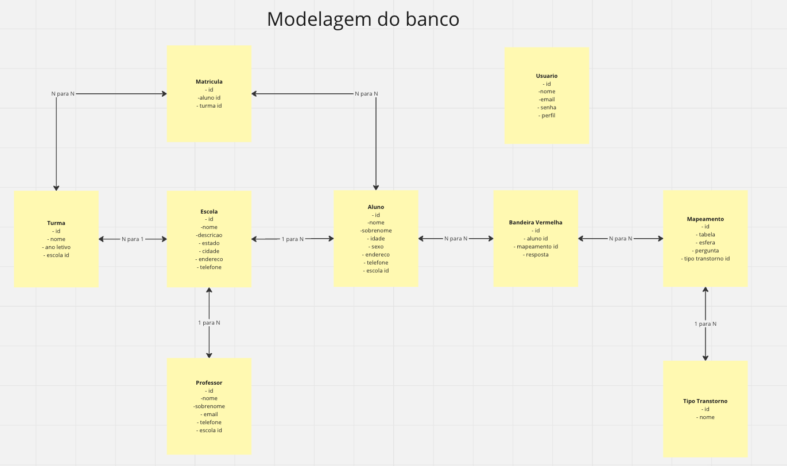
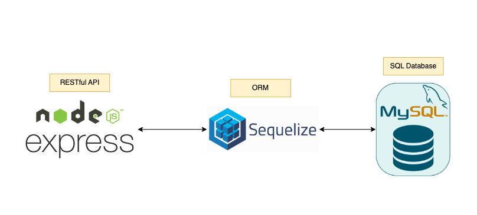

# NeuroMap

Este é o backend do projeto NeuroMap

## Sumário
- [1 Modelagem do banco de dados](#1-modelagem-do-banco-de-dados)
- [2 Arquitetura](#2-arquitetura)
- [3 Tech Stack](#3-tech-stack)
- [4 Estrutura de pastas](#4-estrutura-de-pastas)
- [5 Instalação e rodando local](#5-instalação-e-rodando-local)

## 1 Modelagem do banco de dados

 

## 2 Arquitetura
- Arquitetura em camadas utilizando RESTful API para fornecer http endpoints para o cliente e utilizando o Sequelize como ORM para fazer o mapeamento do banco de dados e agilizar no processo de desenvolvimento



## 3 Tech Stack


## 4 Estrutura de pastas
```sh
.
└── ./app  
    ├── controllers           # Camada de interação entre model e route
    ├── database              # Todos os scripts do banco (DDL e DML)
    ├── documentation         # Documentação da API para ser importado no Postman
    ├── models                # Camada do modelo do banco de dados
    ├── routes                # Camada dos endpoints
└── ./test                    # Teste unitários
```

## 5 Instalação e rodando local
-- Passo a passo para rodar a aplicação local

## 5.1 Faça a instalação do Node.js e o npm

https://nodejs.org/en

## 5.2 Instale o Docker desktop seguindo o passo a passo

https://docs.docker.com/get-docker/

## 5.3 Execute o comando abaixo para instalar o MySql database usando uma imagem do Docker

`docker run --name neuromap-db -e MYSQL_ROOT_PASSWORD=Fiap123 -p 3306:3306 -d mysql:latest`

## 5.4 Configure todos as variaveis de ambiente do projeto (arquivo .env)

DB_PASSWORD=
DB_USER=
DB_HOST=
DB_PORT=
DB_NAME=

## 5.5 Com tudo configurado, instale todas as dependências do projeto e execute local

Vá para a pasta backend do projeto
`cd backend`

Instale as dependências
`npm install`

Execute o projeto
`npm start`

Assim que executado todas as tabelas do banco de dados serão criados e você pode rodar o DML e inserir alguns dados com o script no caminho da pasta abaixo:
`cd app/database/scripts/dml.sql`

Ele vai subir na porta 5000
localhost:5000
